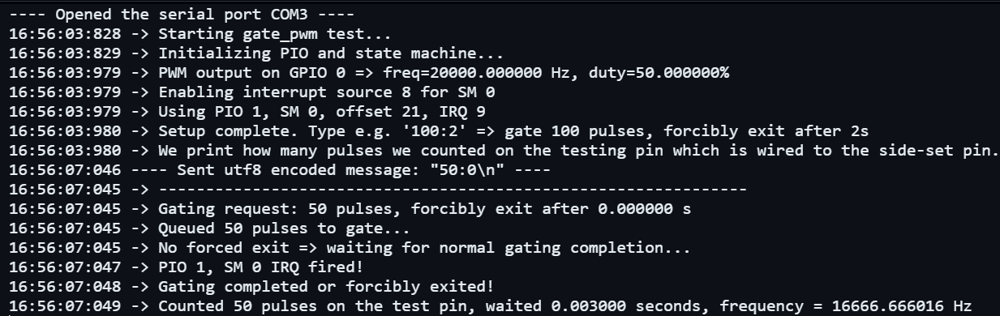

# Gated Pulse Generator via RP2040 pio

## Description

This is a rp2040 arduino program that output a specific number of pulses at a specific frequency, intended for used with stepper motors with a stepper driver.

## Main idea

Using rp2040 pio to relay pulses from a hardware pwm signal to the output gpio pin. At the same time the pio will decrementing a counter whose value is pushed into the pio program FIFO by the main program.

The counter value is set by the user and is decremented every time a pulse is relayed. When the counter reaches zero, the pio will stop relaying pulses and raise an interrupt to the main program.

To start a new pulse, the main program should clear the interrupt flag and push a new value into the pio program FIFO. The pio will then start relaying pulses again and the process repeats.
```cpp
// PIO interrupt handler
void pioIrqHandler()
{
    bool flag = pio_interrupt_get(pio, sm);
    if (flag) // Check if the interrupt was fired
    {
        Serial.printf("PIO %d, SM %d IRQ fired!\n", pio_get_index(pio), sm);
        pio_interrupt_clear(pio, sm); // Clear the interrupt
        irq_clear(pio_irq_num);       // Clear the IRQ flag
        pio_irq_fired = true;
    }
}
void loop()
{
    // push the number of pulses to gate to the PIO state machine
    pio_sm_put_blocking(pio, sm, N);
    // wait for the PIO to finish pulsing
    while (!pio_irq_fired) {
    }
    // reset the flag and push a new value to the FIFO for the next pulse
    pio_irq_fired = false;
    pio_sm_put_blocking(pio, sm, N);
}
```

An additional pin is used to interrupt the pio pulse generation midway through the process. Set this pin to high to forcibly exit the pulse generation. This is useful for applications where we need to stop the pulse generation before it completes.
```cpp
void loop()
{
    // 3) If T>0, we'll forcibly exit after T seconds
    if (T > 0)
    {
        Serial.printf("Waiting %f seconds, then forcing exit mid-way\n", T);
        delayMicroseconds((uint)(T * 1000000)); // wait T seconds
        gpio_put(JMP_PIN, 1);                   // forcibly exit
    }
    else
    {
        Serial.println("No forced exit => waiting for normal gating completion...");
    }
}
```

The frequency and the pulse width of the output signal can be set by changing the reference pwm signal that the pio machine is relaying. hardwarePWM.h provide method for setting the frequency and the pulse width of the hardware pwm signal.

## Benefits of using pio

1. Accurate timing of the output pulses, as the pio is relaying pulses from essentially a hardware pwm signal. As opposed to using a loop in the main program and timers to generate the pulses, which can be affected by other tasks and interrupts running on the CPU.
2. No CPU overhead, as the pio is handling the pulse generation and counting. All CPU has to do is push the number of pulses to the pio FIFO and clear the interrupt flag when the pio has finished pulsing.
3. Easy to adjust the frequency and pulse width of the output signal by changing the reference pwm signal.

## Testing Example

We physically connect the output pin to another free gpio pin on the pico and use arduino attachInterrupt to count the number of output pulses.
```cpp
// 6) Also set up a CPU interrupt to measure the number of pulses seemed on the test pin
// NOTE: the test pin need to be physically wired to the side-set pin during the test
// we use arduino interrupts to count the number of pulses seen on the side-set pin
pinMode(TESTING_PIN, INPUT);
attachInterrupt(digitalPinToInterrupt(TESTING_PIN), testPinISR, RISING);
```

### requesting 50 pulses at 20000Hz, no forced exit



### requesting 100000 pulses at 20000Hz, no forced exit


### requesting 100000 pulses at 20000Hz, forced exit after 1 seconds (early exit)


### requesting 100000 pulses at 20000Hz, forced exit after 10 seconds (late exit, frequency calculated as 100000/10 = 10000Hz)


## References

This program uses the following libraries and compiled in the Arduino IDE:

- Standard Arduino libraries
- Raspberry Pi Pico Arduino core
- Raspberry Pi Pico SDK